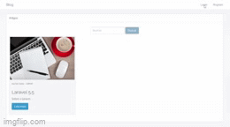
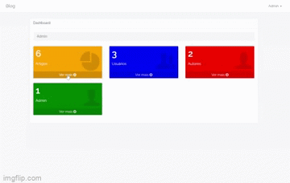
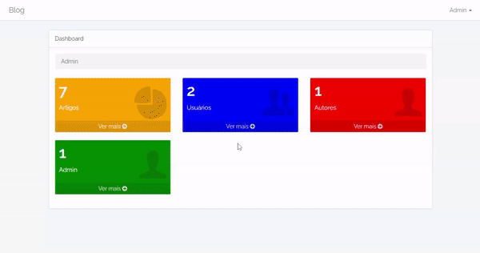
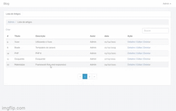

<h1 align="center">Blog</h1>

Uma aplicação blog com gestão de artigos, usuários (admins, autores e visitantes) e agendamento de publicações totalmente componentizada utilizando Laravel 5.5, VueJS 2 e Bootstrap 3.

<p align="center">
	<a href="https://github.com/tarcisioaraujo/blog-laravel-vue/issues">
		
	</a>	
	
		
	
	 
</p>

<p align="center">
	<a href="#computer-tecnologias">Tecnologias</a> •	
	<a href="#white_check_mark-features">Features</a> •
	<a href="#runner-começando">Começando</a> •
	<a href="#warning-pré-requisitos">Pré-requisitos</a> •
	<a href="#elephant-configuração-do-php">Configuração do php</a> •
	<a href="#hammer_and_wrench-instalação">Instalação</a> •
	<a href="#passport_control-login">Login</a> •
	<a href="#construction_worker-autor">Autor</a>
</p>

<p align="center">
	<kbd>
		
	</kbd>
	&nbsp;&nbsp;&nbsp;&nbsp;
	<kbd>
		
	</kbd>
	<br/><br/>
	<kbd>
		
	</kbd>
	&nbsp;&nbsp;&nbsp;&nbsp;
	<kbd>
		
	</kbd>	
</p>

## :computer: Tecnologias 

- [Vue.js](https://br.vuejs.org/)
- [Laravel](https://laravel.com/)
- [PHP](https://www.php.net/)
- [Bootstrap](https://getbootstrap.com/)

## :white_check_mark: Features

- [ ] Upload de imagem ilustrativa no artigo;

## :runner: Começando 

Essas instruções fornecerão uma cópia do projeto instalado e funcionando em sua máquina local.

## :warning: Pré-requisitos 

O que você precisar para instalar a aplicação

```
PHP 7.1.8 - 7.4.16
Composer >= 1.4.2
Node >= 8.6.0
```
### :elephant: Configuração do php 

```
# Habilitar os recursos no php.ini
extension=mbstring
extension=openssl
extension=pdo_sqlite
extension_dir = "ext"
```

## :hammer_and_wrench: Instalação

Passos para rodar a aplicação

```
# Clonar
git clone https://github.com/tarcisioaraujo/blog-laravel-vue.git

# Acessar o diretório
cd blog-laravel-vue

# Instalar e atualizar as dependências do Composer (leva alguns minutos ☕)
composer install
composer update

# Instalar as dependências do Node JS
npm install

# Configurar variáveis de ambiente
cp .env.example .env
php artisan key:generate

# Alterar o arquivo .env para ficar dessa forma
DB_CONNECTION=sqlite
//DB_HOST=127.0.0.1
//DB_PORT=3306
//DB_DATABASE=homestead
//DB_USERNAME=homestead
//DB_PASSWORD=secret

# Criar arquivo do banco de dados SQLite
copy con .\database\database.sqlite
<aperte a tecla F6>

# Criar tabelas do Banco de Dados
php artisan migrate

# Rodar Servidor PHP
php artisan serve

# Acessar o endereço 
http://localhost:8000
```
## :passport_control: Login 

Usuário de teste

```
E-mail: admin@mail.com
Password: 123456
```

## :construction_worker: Autor

<a href="https://github.com/tarcisioaraujo">
 
 <br />
 <sub><b>Tarcísio Silva de Araújo</b></sub></a> <a href="https://github.com/tarcisioaraujo" title="GitHub"></a>

Feito por Tarcísio Silva de Araújo 👋

[](https://www.linkedin.com/in/tarcisiosaraujo/) 
[](mailto:tarcisio.saraujo@gmail.com)